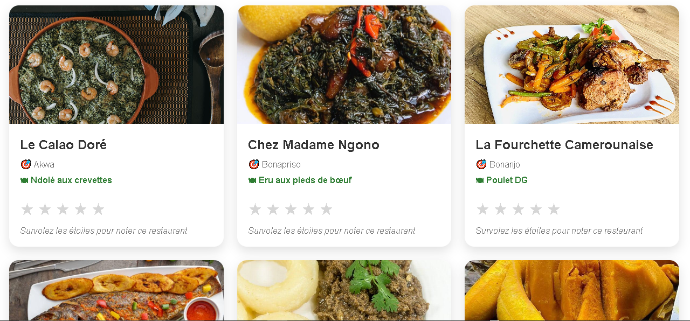
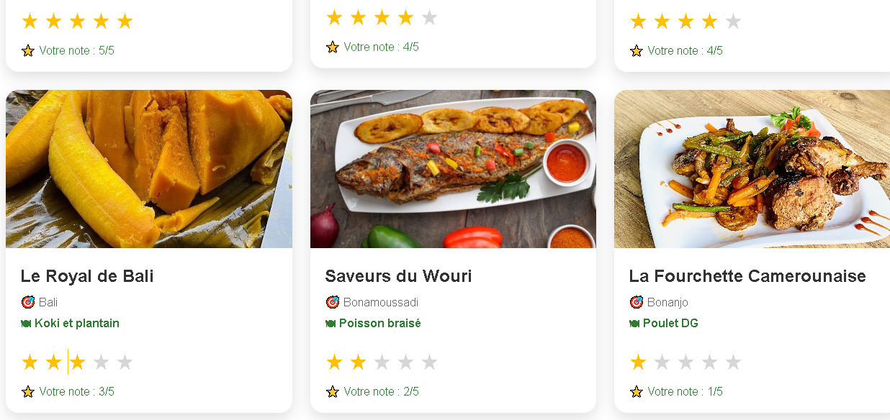

# �️ Délices de Douala — TP Angular Jour 8


---

## 📋 Vue d'ensemble

Application web restaurant moderne mettant en avant les **meilleures pratiques Angular modernes** :  
Signals, Services centralisés, HTTP moderne (httpResource), et architecture réactive.

### Missions
✅ **6/6 Missions obligatoires** complètes (50/50 points)  
✅ **Bonus** Recherche + Design + Stats (+3 points)  
✅ **100% Charte ATL2026** Conformité totale  

---

## 🎯 Démarrage rapide

```bash
# Installation
npm install

# Lancer (port 8080)
ng serve --host 0.0.0.0 --port 8080

# Ouvrir
http://localhost:8080
```

---

## 📌 Présentation

**Délices de Douala** est une application web moderne développée avec Angular permettant de découvrir, explorer et noter les restaurants de Douala.
L'application met l'accent sur **l'interactivité en temps réel**, **un design UI/UX moderne** et **une gestion d'état réactive grâce aux Signals d'Angular**.

---

## ✨ Fonctionnalités principales

---

## ⭐ Système de notation intelligent
Notation interactive de 1 à 5 étoiles
Aperçu au survol avec messages dynamiques
Mise à jour instantanée de l’état via les Signals Angular

---

## 📊 Tableau de bord analytique en temps réel
Nombre de restaurants notés
Calcul de la moyenne des notes
Mises à jour automatiques en temps réel

---

## 🔎 Filtrage intelligent
Affichage de tous les restaurants
Filtrage des restaurants notés ≥ 4 étoiles

---

## 🖼️ Interface utilisateur moderne (UI/UX)
Design responsive (mobile-first)
Cartes de restaurants avec images
Effets d’animation au survol
En-tête propre avec image de fond

---

## 🧠 Points techniques clés
Composants Angular autonomes (Standalone Components)
Gestion d’état basée sur les Signals
Mises à jour réactives de l’interface (sans manipulation directe du DOM)
Architecture orientée composants
Séparation claire des responsabilités

---

## 🏗️ Project Architecture

```text
src/
│
├── app/
│   ├── components/
│   │   ├── header/
│   │   ├── restaurant-list/
│   │   ├── restaurant-card/
│   │   └── star-rating/
│   │
│   ├── models/
│   │   └── restaurant.ts
│   │
│   ├── app.ts
│   ├── app.html
│   └── app.css
│
├── assets/
│   ├── images/
│       ├────demo/
```

---

## 📸 Screenshots

### 🏠 Page d'accueil


### 🍽️ Liste restaurant


### ⭐ Notation



---

## ⚙️ Installation

```bash
git clone https://github.com/Hunter13-cmr/delices-de-douala-tp.git
cd delices-de-douala
npm install
ng serve
```

👉 Accès : http://localhost:4200

---

## 📦 Production Build

```bash
ng build --configuration production
```

---

## 🌍 Deployment (GitHub Pages)

```bash
ng add angular-cli-ghpages
ng deploy
```

---

## 🚀 Améliorations futures
- 🔐 Authentification utilisateur
- 💬 Système de commentaires
- ❤️ Favoris
- 📍 Géolocalisation des restaurants
- ☁️ Backend API (Firebase / Node.js)
- 📱 Version mobile PWA

---

## 👨‍💻 Auteur

Développé par **ELOCK SADRACK FIDELE**
**Projet Angular – Formation Développement Web Front-end Angular Talent Lab 2026 (Orange Digital Center)**

📜 Licence

**Projet académique – libre d’utilisation à des fins éducatives.**

